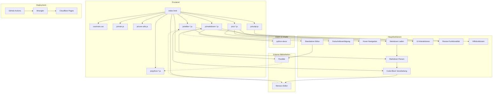
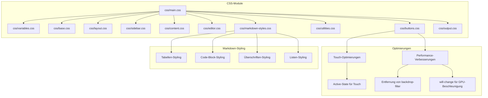
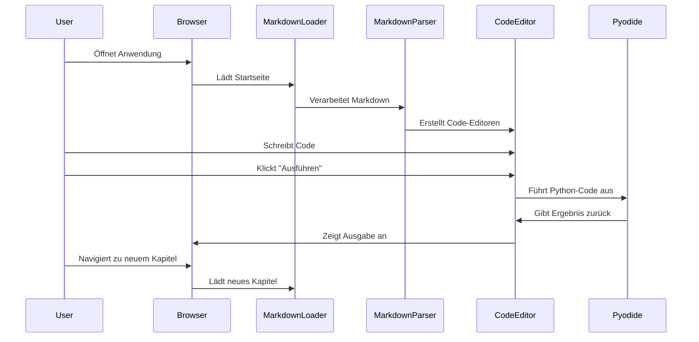
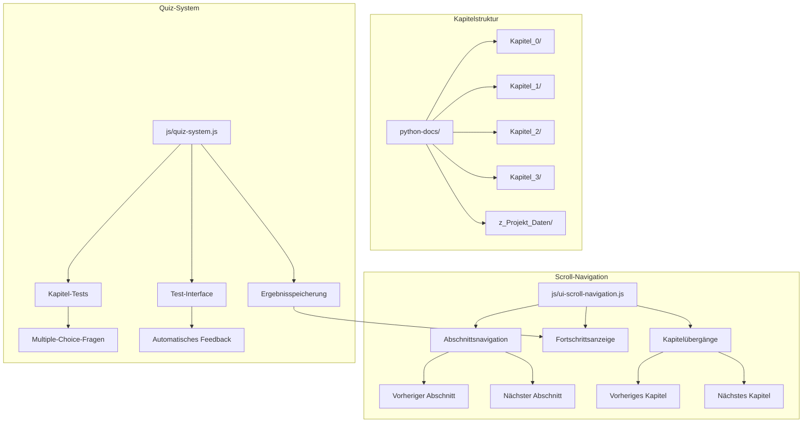

# Python-Lernplattform: Architektur und Wartungsanleitung

Diese Dokumentation bietet einen Überblick über die Architektur und Funktionsweise der Python-Lernplattform, um die Wartung und Weiterentwicklung zu erleichtern. Die Plattform ermöglicht interaktives Lernen von Python direkt im Browser ohne Installation von Software.

## Schnellstart

1. **Lokale Entwicklung starten:**
   ```bash
   # Lokalen Entwicklungsserver starten
   node js/server.js
   ```

2. **Neue Inhalte hinzufügen:**
   - Erstelle neue Markdown-Dateien im Verzeichnis `python-docs/`
   - Füge Links zu neuen Dateien in `python-docs/Kapitel_0/Anfang_Lese_Mich.md` hinzu

3. **Deployment:**
   - Push zum Hauptbranch löst automatisches Deployment auf Cloudflare Pages aus
   - Oder manuell mit `wrangler pages publish .`

## Architekturübersicht

Die Python-Lernplattform ist eine clientseitige Webanwendung, die Markdown-Dokumente lädt, interaktive Python-Code-Editoren bereitstellt und Python-Code direkt im Browser ausführt.



### CSS-Modulstruktur

Die CSS-Struktur ist modular aufgebaut und wird über main.css importiert:



### Datenfluss

1. **Initialisierung**:
   - Die Anwendung wird in `index.html` geladen
   - `main.js` initialisiert alle Module
   - Die verschiedenen JavaScript-Module im js-Ordner werden in der richtigen Reihenfolge geladen

2. **Markdown-Verarbeitung**:
   - Markdown-Dateien werden aus dem `python-docs/`-Verzeichnis geladen
   - Markdown wird in HTML umgewandelt
   - Code-Blöcke werden extrahiert und durch interaktive Editoren ersetzt

3. **Code-Ausführung**:
   - Pyodide wird bei Bedarf geladen
   - Python-Code wird im Browser ausführt
   - Ausgabe wird im entsprechenden Ausgabebereich angezeigt

4. **Fortschrittsverfolgung**:
   - Abgeschlossene Kapitel werden im localStorage gespeichert
   - Fortschrittsanzeige wird aktualisiert

5. **Vertikale Scroll-Navigation**:
   - Ermöglicht Navigation zwischen Abschnitten und Kapiteln durch vertikales Scrollen
   - Navigationselemente am Ende jeder Sektion
   - Zeigt Fortschrittsindikator an
   - Unterstützt Tastaturnavigation
   - Natürlicheres Leseerlebnis von oben nach unten



### Komponentendetails

#### Kernkomponenten

| Komponente | Dateien | Hauptfunktionen |
|------------|--------|----------------|
| **HTML-Struktur** | `index.html`, `code-editor.html` | Definiert die grundlegende Seitenstruktur mit drei Hauptbereichen: Sidebar-Navigation, Code-Editor und Inhaltsbereich. `code-editor.html` bietet einen eigenständigen Python-Editor |
| **Styling** | `css/main.css` und Module | Implementiert responsives Design mit CSS Grid und Flexbox, definiert Farbschema und UI-Komponenten |
| **Markdown-Styling** | `css/markdown-styles.css` | Spezifische Stile für Markdown-Elemente wie Tabellen, Code-Blöcke, Überschriften und Listen |
| **Core Utilities** | `js/core-utils.js` | Stellt grundlegende Hilfsfunktionen wie Debouncing bereit |
| **Python Integration** | `js/python-pyodide.js`, `js/python-executor.js` | Lädt Pyodide und führt Python-Code aus |
| **Editor-Funktionalität** | `js/editor-standalone.js`, `js/editor-codeblocks.js`, `js/editor-resize.js` | Verwaltet den eigenständigen Code-Editor und eingebettete Code-Blöcke, implementiert Resize-Funktionalität |
| **UI-Komponenten** | `js/ui-navigation.js`, `js/ui-progress.js`, `js/ui-hover-navigation.js` | Verwaltet Navigation, Sidebar, Fortschrittsverfolgung und Hover-Navigation |
| **Markdown-Verarbeitung** | `js/markdown-loader.js`, `js/markdown-parser.js`, `js/markdown-cache.js` | Lädt und verarbeitet Markdown-Dateien, extrahiert Code-Blöcke, verwaltet Fortschritt |
| **Hilfsfunktionen** | `js/script.js` | Enthält ergänzende Funktionen für die Plattform |
| **Haupteinstiegspunkt** | `js/main.js` | Initialisiert alle Module und richtet Event-Listener ein |

#### Technische Implementierungsdetails

1. **Markdown-Verarbeitung**:
   - Verwendet reguläre Ausdrücke zur Extraktion von Code-Blöcken und Umwandlung von Markdown in HTML
   - Implementiert einen Pfad-Cache für effizientes Auffinden von Markdown-Dateien
   - Korrigiert relative Pfade in Markdown-Links für korrekte Navigation
   - Verbesserte Markdown-Tabellen-Verarbeitung mit spezifischen Stilen in `css/markdown-styles.css`

2. **Code-Editor-Integration**:
   - Monaco Editor wird für Syntax-Highlighting und Code-Bearbeitung verwendet
   - Editoren werden dynamisch für jeden Code-Block erstellt
   - Unterstützt verschiedene Programmiersprachen mit entsprechendem Syntax-Highlighting

3. **Python-Ausführung**:
   - Pyodide wird lazy-loaded, um die initiale Ladezeit zu verbessern
   - Standard-Output wird umgeleitet, um Konsolenausgaben zu erfassen
   - Fehlerbehandlung für Python-Ausführungsfehler

4. **Responsive Design**:
   - Mobile-First-Ansatz mit drei Breakpoints (Mobile, Tablet, Desktop)
   - Anpassbare Layouts mit ein-/ausklappbaren Seitenleisten
   - Resize-Funktionalität für den Code-Editor
   - Touch-Optimierungen für mobile Geräte

5. **Deployment-Prozess**:
   - GitHub Actions Workflow wird durch Pushes zum Hauptbranch ausgelöst
   - Wrangler (Cloudflare CLI) deployt die Anwendung auf Cloudflare Pages
   - Statische Dateien werden direkt aus dem Repository-Root bereitgestellt
   - Worker-Name in wrangler.toml ist "python3"



### Herausforderungen und Lösungen

Bei der Entwicklung der Python-Lernplattform wurden mehrere technische Herausforderungen gelöst:

| Herausforderung | Lösung | Implementierung |
|-----------------|--------|----------------|
| **Python im Browser ausführen** | Integration von Pyodide | Lazy-Loading von Pyodide, Umleitung der Standardausgabe, asynchrone Ausführung |
| **Dynamische Markdown-Verarbeitung** | Eigener Markdown-Parser | Reguläre Ausdrücke für Markdown-Elemente, Extraktion von Code-Blöcke, Pfadkorrektur für Links |
| **Responsive Layout** | CSS Grid mit dynamischen Bereichen | Anpassbare Grid-Template-Columns, Media Queries für verschiedene Geräte, ein-/ausklappbare Seitenleisten |
| **Performance-Optimierung** | Caching und Lazy-Loading | Markdown-Datei-Cache, verzögerte Initialisierung von Pyodide, Debouncing für Layout-Aktualisierungen, Touch-Optimierungen |
| **Fortschrittsverfolgung** | Client-seitiges Speichern | localStorage für Benutzerdaten, dynamische Aktualisierung der UI basierend auf Fortschritt |

### Architekturprinzipien

Die Architektur der Python-Lernplattform folgt mehreren wichtigen Prinzipien:

1. **Modularität**: Klare Trennung von Verantwortlichkeiten zwischen den Dateien
   - `index.html`: Struktur und Einbindung von Ressourcen
   - `css/main.css` und CSS-Module: Styling und Layout
   - Modulare JavaScript-Dateien im js-Ordner mit spezifischen Aufgaben:
     - Core-Module: `js/core-utils.js`
     - Python-Module: `js/python-pyodide.js`, `js/python-executor.js`
     - Editor-Module: `js/editor-standalone.js`, `js/editor-codeblocks.js`, `js/editor-resize.js`
     - UI-Module: `js/ui-navigation.js`, `js/ui-progress.js`, `js/ui-scroll-navigation.js`, `js/quiz-system.js`
     - Markdown-Module: `js/markdown-loader.js`, `js/markdown-parser.js`, `js/markdown-cache.js`
     - Hilfsfunktionen: `js/script.js`
     - Hauptmodul: `js/main.js`

2. **Progressive Enhancement**: Die Anwendung funktioniert auch mit eingeschränkten Funktionen
   - Grundlegende Inhalte sind auch ohne JavaScript zugänglich
   - Responsive Design passt sich an verschiedene Geräte an
   - Fallback-Optionen für nicht unterstützte Funktionen

3. **Clientseitige Verarbeitung**: Keine Serverabhängigkeit für die Kernfunktionalität
   - Alle Inhalte werden statisch bereitgestellt
   - Python-Code wird vollständig im Browser ausgeführt
   - Benutzerdaten werden lokal gespeichert

4. **Erweiterbarkeit**: Die Architektur ermöglicht einfache Erweiterungen
   - Neue Kapitel können durch Hinzufügen von Markdown-Dateien erstellt werden
   - Unterstützung für verschiedene Programmiersprachen im Code-Editor
   - Modulare Struktur für einfache Erweiterung der Funktionalität

### Zukünftige Erweiterungsmöglichkeiten

Die Architektur der Python-Lernplattform wurde mit Blick auf zukünftige Erweiterungen entwickelt. Hier sind einige mögliche Erweiterungen:

#### Funktionale Erweiterungen

| Erweiterung | Beschreibung | Implementierungsansatz |
|-------------|--------------|------------------------|
| **Benutzerkonten** | Synchronisierung des Fortschritts zwischen Geräten | Integration mit Auth-Diensten, Backend-API für Fortschrittsspeicherung |
| **Interaktive Übungen** | Automatisch bewertete Programmieraufgaben | Testfälle in Pyodide ausführen, Ergebnisse validieren und Feedback geben |
| **Kollaborative Features** | Gemeinsames Bearbeiten von Code | Integration von WebSockets oder ähnlichen Technologien für Echtzeit-Kollaboration |
| **Offline-Unterstützung** | Nutzung ohne Internetverbindung | Service Worker für Caching, IndexedDB für lokale Datenspeicherung |
| **Erweiterte Visualisierungen** | Visualisierung von Algorithmen und Datenstrukturen | Integration von Visualisierungsbibliotheken wie D3.js oder Python-Bibliotheken in Pyodide |
| **Markdown-Tabellen** | Vollständige Unterstützung für Markdown-Tabellen | Implementierung einer eigenen Tabellen-Verarbeitung im Markdown-Parser |

#### Technische Verbesserungen

1. **Performance-Optimierungen**:
   - Lazy-Loading von Markdown-Inhalten
   - Virtualisierung für lange Listen in der Navigation
   - Optimierung der Pyodide-Ladezeit und -Speichernutzung
   - Reduzierung von aufwändigen CSS-Effekten (backdrop-filter, box-shadow)
   - Dynamische Anpassung des Container-Paddings beim Ein-/Ausblenden des Editors

2. **Erweiterte Code-Editor-Funktionen**:
   - Intellisense und Autovervollständigung
   - Debugging-Funktionalität
   - Unterstützung für mehrere Dateien in einem Projekt

3. **Verbesserte Barrierefreiheit**:
   - Vollständige Tastaturnavigation
   - Screenreader-Unterstützung
   - Hoher Kontrast und anpassbare Schriftgrößen

4. **Erweiterte Inhaltsformate**:
   - Unterstützung für interaktive Diagramme
   - Einbettung von Videos und anderen Medien
   - Erweiterte interaktive Quizze mit zusätzlichen Fragetypen (bereits grundlegende Quiz-Funktionalität implementiert)

Diese Erweiterungsmöglichkeiten können schrittweise implementiert werden, ohne die bestehende Architektur grundlegend zu ändern, dank des modularen Aufbaus der Plattform.

## Deployment auf Cloudflare Pages

Diese Anwendung wird automatisch auf Cloudflare Pages deployt, wenn Änderungen zum Hauptbranch gepusht werden. Das Deployment wird durch GitHub Actions und Wrangler (Cloudflare's CLI-Tool) gesteuert.

### Einrichtung der GitHub Secrets

Um das automatische Deployment zu ermöglichen, müssen folgende GitHub Secrets eingerichtet werden:

1. Gehen Sie zu Ihrem GitHub-Repository
2. Navigieren Sie zu "Settings" > "Secrets and variables" > "Actions"
3. Fügen Sie folgende Secrets hinzu:
   - `CLOUDFLARE_API_TOKEN`: Ein API-Token von Cloudflare mit Berechtigung zum Deployment auf Pages
   - `CLOUDFLARE_ACCOUNT_ID`: Ihre Cloudflare Account ID

### Erstellen eines Cloudflare API-Tokens

1. Melden Sie sich bei Ihrem Cloudflare-Dashboard an
2. Gehen Sie zu "My Profile" > "API Tokens"
3. Klicken Sie auf "Create Token"
4. Wählen Sie "Create Custom Token"
5. Geben Sie dem Token einen Namen (z.B. "GitHub Actions Deployment")
6. Fügen Sie folgende Berechtigungen hinzu:
   - Account > Cloudflare Pages > Edit
   - Zone > Zone > Read
7. Erstellen Sie das Token und kopieren Sie es (Sie werden es nur einmal sehen)

### Finden Ihrer Cloudflare Account ID

Ihre Cloudflare Account ID finden Sie im Cloudflare Dashboard unter "Workers & Pages" > "Overview" in der URL oder in der rechten Seitenleiste.

## Dateistruktur

Die Plattform besteht aus folgenden Hauptdateien:

| Datei | Beschreibung |
|-------|-------------|
| **index.html** | Hauptdatei mit der HTML-Struktur der Anwendung |
| **code-editor.html** | Eigenständiger Python-Editor mit Vollbild-Interface |
| **css/main.css** | Importiert alle CSS-Module |
| **css/variables.css** | Enthält CSS-Variablen für Farben, Abstände, etc. |
| **css/base.css** | Grundlegende Styling-Regeln |
| **css/layout.css** | Layout-Struktur mit CSS Grid |
| **css/sidebar.css** | Styling für die Sidebar-Navigation |
| **css/content.css** | Styling für den Inhaltsbereich |
| **css/editor.css** | Styling für den Code-Editor |
| **css/buttons.css** | Styling für Buttons mit Touch-Optimierungen |
| **css/utilities.css** | Hilfsklassen für häufig verwendete Styles |
| **css/markdown-styles.css** | Spezifische Stile für Markdown-Elemente |
| **css/output.css** | Styling für den Ausgabebereich des Code-Editors |
| **js/core-utils.js** | Grundlegende Hilfsfunktionen wie Debouncing |
| **js/python-pyodide.js** | Laden und Initialisierung von Pyodide |
| **js/python-executor.js** | Ausführung von Python-Code |
| **js/editor-standalone.js** | Funktionalität für den eigenständigen Editor |
| **js/editor-codeblocks.js** | Funktionalität für eingebettete Code-Blöcke |
| **js/editor-resize.js** | Größenänderungsfunktionalität für Editoren |
| **js/ui-navigation.js** | Navigation und Sidebar-Funktionalität |
| **js/ui-progress.js** | Fortschrittsverfolgung |
| **js/ui-scroll-navigation.js** | Vertikale Scroll-Navigation zwischen Abschnitten und Kapiteln |
| **js/quiz-system.js** | Quiz-System für interaktive Tests zu verschiedenen Kapiteln |
| **js/markdown-cache.js** | Caching von Markdown-Dateien |
| **js/markdown-parser.js** | Parsing von Markdown zu HTML |
| **js/markdown-loader.js** | Laden von Markdown-Dateien |
| **js/script.js** | Ergänzende Hilfsfunktionen |
| **js/main.js** | Haupteinstiegspunkt und Initialisierung |
| **js/server.js** | Lokaler Entwicklungsserver |
| **wrangler.toml** | Konfiguration für Cloudflare Pages mit Worker-Namen "python3" |
| **python-docs/** | Verzeichnis mit den Markdown-Dokumentationen, nach Kapiteln organisiert |

## Hauptkomponenten

Die Anwendung besteht aus drei Hauptkomponenten in der Hauptansicht und einer separaten Vollbild-Editor-Ansicht:

| Komponente | Beschreibung |
|------------|-------------|
| **Sidebar-Navigation** | Linke Seitenleiste mit Kapitelübersicht und Fortschrittsanzeige |
| **Code-Editor** | Zentraler Bereich mit einem eigenständigen Python-Editor |
| **Markdown-Inhalt** | Bereich unter dem Code-Editor, der die Lernmaterialien anzeigt |
| **Vollbild-Editor** | Separate Seite (`code-editor.html`) mit einem eigenständigen Python-Editor im Vollbildmodus |
| **Quiz-System** | Interaktive Tests zu verschiedenen Kapiteln mit automatischer Bewertung und Feedback |

### Layout-Struktur

Das Layout verwendet CSS Grid mit folgender Struktur:

```css
.container {
    display: grid;
    grid-template-columns: 250px 300px 1fr;
    grid-template-areas: "sidebar editor-sidebar content";
}
```

| Bereich | Beschreibung |
|---------|-------------|
| `sidebar` | Linke Navigationsleiste |
| `editor-sidebar` | Code-Editor in der Mitte |
| `content` | Markdown-Inhalt rechts |

Auf mobilen Geräten ändert sich das Layout zu:

```css
.container {
    grid-template-columns: 1fr;
    grid-template-areas:
        "editor-sidebar"
        "content";
}
```

## Markdown-Verarbeitung

Die Markdown-Verarbeitung erfolgt in `js/markdown-loader.js` und umfasst folgende Schritte:

1. **Laden der Markdown-Dateien**: Die Funktion `loadMarkdownFile(filePath)` lädt eine Markdown-Datei von einem angegebenen Pfad.
2. **Pfadkorrektur**: Die Funktion `correctPath(path)` korrigiert Pfade in Markdown-Links.
3. **Markdown-Parsing**: Die Funktion `parseMarkdown(markdown)` wandelt Markdown in HTML um.
4. **Code-Block-Verarbeitung**: Code-Blöcke werden extrahiert und durch interaktive Editoren ersetzt.

### Markdown-Datei-Cache

Die Plattform verwendet einen Cache für Markdown-Dateien, um die Ladezeiten zu verbessern:

```javascript
// Initialisiere den Markdown-Datei-Cache
async function initializeMarkdownCache() {
    markdownFileCache = {};
    await scanDirectoryRecursively(DOCS_BASE_DIR);
}
```

## Code-Editor-Funktionalität

Die Plattform bietet drei Arten von Code-Editoren:

1. **Eingebettete Editoren**: In Markdown-Inhalten eingebettete Code-Blöcke werden zu interaktiven Editoren.
2. **Eigenständiger Editor**: Ein separater Editor in der Seitenleiste für freies Experimentieren.
3. **Vollbild-Editor**: Eine separate Seite (`code-editor.html`) mit einem eigenständigen Python-Editor im Vollbildmodus, optimiert für fokussiertes Programmieren.

### Monaco Editor Integration

Die Plattform verwendet den Monaco Editor für die Code-Bearbeitung:

```javascript
// Erstelle den Editor
const standaloneEditor = monaco.editor.create(document.getElementById('standalone-editor'), {
    value: '# Schreibe deinen Python-Code hier\n\n# Beispiel:\nprint("Hallo, Welt!")',
    language: 'python',
    theme: 'vs-dark',
    automaticLayout: true,
    // weitere Optionen...
});
```

### Pyodide Integration

Die Python-Code-Ausführung erfolgt mit Pyodide:

```javascript
// Lade Pyodide
async function loadPyodideIfNeeded() {
    if (window.pyodide) return window.pyodide;
    // Lade Pyodide...
    window.pyodide = await loadPyodide();
    return window.pyodide;
}

// Führe Python-Code aus
async function runPythonCode(editorId) {
    // Code ausführen und Ausgabe anzeigen...
}
```

## Responsive Design

Die Plattform verwendet ein responsives Design mit drei Breakpoints:

| Gerät | Bildschirmgröße | Layout |
|-------|----------------|--------|
| **Mobile** | < 768px | Einspaltiges Layout, ausgeblendete Seitenleisten |
| **Tablet** | 768px - 992px | Zweispaltiges Layout |
| **Desktop** | > 992px | Dreispaltiges Layout mit allen Komponenten sichtbar |

### Ein-/Ausklappbare Komponenten

Beide Seitenleisten können ein- und ausgeklappt werden:

```javascript
// Toggle-Button für den Editor-Sidebar
document.getElementById('toggle-editor-sidebar').addEventListener('click', function() {
    document.getElementById('code-editor-sidebar').classList.toggle('collapsed');
    // Layout aktualisieren...
});
```

## Quiz-System

Die Plattform bietet ein interaktives Quiz-System zur Überprüfung des Lernfortschritts:

1. **Quiz-Struktur**:
   - Kapitelspezifische Tests mit Multiple-Choice-Fragen
   - Automatische Bewertung und detaillierte Erklärungen
   - Speicherung der Ergebnisse im localStorage

2. **Integration in die Seitenleiste**:
   - Eigener "TEST"-Bereich in der Seitenleiste
   - Anzeige des Fortschritts mit Punktzahlen
   - Farbliche Hervorhebung abgeschlossener Tests

3. **Implementierung**:
   - Definiert in `js/quiz-system.js`
   - Dynamische Erstellung von Quiz-Formularen
   - Responsive Design für alle Bildschirmgrößen

```javascript
// Beispiel für die Quiz-Datenstruktur
const quizData = {
    'kapitel1': {
        title: 'Test: Grundlagen',
        description: 'Teste dein Wissen über Python-Grundlagen',
        questions: [
            {
                question: 'Was ist der Ausgabewert von print("Hello" + " " + "World")?',
                options: [
                    'Hello World',
                    '"Hello World"',
                    'Hello + World',
                    'Error'
                ],
                correctAnswer: 0,
                explanation: 'In Python können Strings mit dem + Operator verkettet werden.'
            },
            // Weitere Fragen...
        ]
    }
    // Weitere Kapitel-Tests...
};
```

## Erweiterungsmöglichkeiten

### Neue Kapitel hinzufügen

Um neue Kapitel hinzuzufügen:

1. Erstelle eine neue Markdown-Datei im entsprechenden Kapitel-Verzeichnis
2. Füge einen Link zur neuen Datei in der Hauptseite (`Anfang_Lese_Mich.md`) hinzu

### Neue Funktionen hinzufügen

Für neue Funktionen:

1. **Neue UI-Elemente**: Füge HTML in `index.html` hinzu
2. **Styling**: Erweitere die entsprechenden CSS-Module
3. **Funktionalität**: Implementiere JavaScript in den entsprechenden Modulen oder erstelle neue Module

## Wartungstipps

### Häufige Probleme und Fehlerbehebung

| Problem | Lösung | Weitere Schritte |
|---------|--------|----------------|
| **Markdown-Dateien werden nicht gefunden** | Überprüfe die Pfade und den Markdown-Cache in `js/markdown-cache.js` | Prüfe die Konsole auf Fehler bei der Pfadauflösung |
| **Code-Editor wird nicht angezeigt** | Überprüfe die Monaco-Editor-Initialisierung in `js/editor-standalone.js` und `js/editor-codeblocks.js` | Stelle sicher, dass die Monaco-Editor-CDN erreichbar ist |
| **Python-Code kann nicht ausgeführt werden** | Überprüfe die Pyodide-Integration in `js/python-pyodide.js` und `js/python-executor.js` | Prüfe die Konsole auf Fehler bei der Pyodide-Initialisierung |
| **CORS-Fehler bei lokalem Testen** | Verwende den lokalen Entwicklungsserver mit `node js/server.js` | Alternativ einen Browser mit deaktivierten CORS-Einschränkungen verwenden |
| **Markdown-Tabellen werden nicht korrekt angezeigt** | Überprüfe die Tabellen-Stile in `css/markdown-styles.css` | Bei komplexen Tabellen HTML-Tabellen verwenden |
| **Vollbild-Editor funktioniert nicht** | Überprüfe die Initialisierung in `code-editor.html` | Stelle sicher, dass alle erforderlichen Skripte geladen werden |
| **Langsame Ladezeiten** | Überprüfe die Netzwerkaktivität in den Browser-DevTools | Reduziere die Anzahl der externen Ressourcen oder implementiere Lazy-Loading |
| **Mobile Darstellungsprobleme** | Überprüfe die CSS-Media-Queries in den entsprechenden CSS-Modulen | Teste mit verschiedenen Geräten und Bildschirmgrößen |
| **Quiz-System funktioniert nicht** | Überprüfe die Initialisierung in `js/quiz-system.js` | Stelle sicher, dass localStorage verfügbar ist und die Quiz-Daten korrekt definiert sind |

### Performance-Optimierung

Die Plattform verwendet mehrere Techniken zur Performance-Optimierung:

| Technik | Beschreibung | Implementierungsort |
|---------|-------------|---------------------|
| **Lazy Loading** | Pyodide wird erst geladen, wenn es benötigt wird | `js/python-pyodide.js` |
| **Debouncing** | Verhindert zu häufige Layout-Aktualisierungen | `js/core-utils.js` |
| **Caching** | Markdown-Dateien werden gecacht | `js/markdown-cache.js` |
| **Touch-Optimierungen** | Entfernung von backdrop-filter, will-change für GPU-Beschleunigung | `css/buttons.css`, `css/content.css` |
| **Optimierte CSS-Effekte** | Reduzierung von aufwändigen CSS-Effekten wie backdrop-filter und box-shadow | Alle CSS-Module |
| **Dynamisches Padding** | Anpassung des Container-Paddings beim Ein-/Ausblenden des Editors | `js/editor-resize.js` |
| **Reduzierte Animationen** | Respektiert `prefers-reduced-motion` für Benutzer, die Animationen reduzieren möchten | `css/base.css` |
| **Code-Splitting** | Modulare JavaScript-Dateien für bessere Caching-Möglichkeiten | Alle JS-Module |

### Browser-Kompatibilität

Die Plattform wurde für moderne Browser optimiert. Bei Problemen mit älteren Browsern:

| Überprüfung | Details | Mindestanforderungen |
|-------------|---------|----------------------|
| CSS-Kompatibilität | Grid, Flexbox, CSS-Variablen | Chrome 60+, Firefox 54+, Safari 10.1+, Edge 16+ |
| JavaScript-Kompatibilität | async/await, ES6-Features, Modules | Chrome 63+, Firefox 58+, Safari 11.1+, Edge 79+ |
| Pyodide-Kompatibilität | WebAssembly-Unterstützung | Chrome 57+, Firefox 52+, Safari 11+, Edge 16+ |

## Lokale Entwicklung

### Voraussetzungen

- Node.js (für den lokalen Entwicklungsserver)
- Moderner Browser mit WebAssembly-Unterstützung

### Entwicklungsserver starten

```bash
node js/server.js
```

Der Server läuft standardmäßig auf Port 3000. Öffne http://localhost:3000 im Browser.

### Änderungen testen

1. Bearbeite die Dateien im Editor deiner Wahl
2. Aktualisiere den Browser, um die Änderungen zu sehen
3. Überprüfe die Browser-Konsole auf Fehler oder Warnungen

### Best Practices

- Halte die modulare Struktur bei
- Teste auf verschiedenen Geräten und Browsern
- Optimiere Bilder und externe Ressourcen
- Verwende die Browser-DevTools zur Performance-Analyse