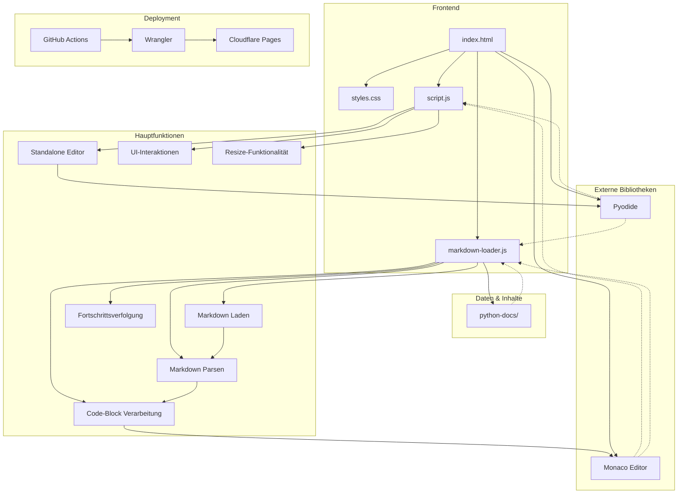

# Python-Lernplattform: Architektur und Wartungsanleitung

Diese Dokumentation bietet einen Überblick über die Architektur und Funktionsweise der Python-Lernplattform, um die Wartung und Weiterentwicklung zu erleichtern.

## Architekturübersicht

Die Python-Lernplattform ist eine clientseitige Webanwendung, die Markdown-Dokumente lädt, interaktive Python-Code-Editoren bereitstellt und Python-Code direkt im Browser ausführt.



### Datenfluss

1. **Initialisierung**:
   - Die Anwendung wird in `index.html` geladen
   - `script.js` initialisiert den eigenständigen Code-Editor
   - `markdown-loader.js` lädt die Startseite und initialisiert den Markdown-Cache

2. **Markdown-Verarbeitung**:
   - Markdown-Dateien werden aus dem `python-docs/`-Verzeichnis geladen
   - Markdown wird in HTML umgewandelt
   - Code-Blöcke werden extrahiert und durch interaktive Editoren ersetzt

3. **Code-Ausführung**:
   - Pyodide wird bei Bedarf geladen
   - Python-Code wird im Browser ausgeführt
   - Ausgabe wird im entsprechenden Ausgabebereich angezeigt

4. **Fortschrittsverfolgung**:
   - Abgeschlossene Kapitel werden im localStorage gespeichert
   - Fortschrittsanzeige wird aktualisiert

### Komponentendetails

#### Kernkomponenten

| Komponente | Datei | Hauptfunktionen |
|------------|-------|----------------|
| **HTML-Struktur** | `index.html` | Definiert die grundlegende Seitenstruktur mit drei Hauptbereichen: Sidebar-Navigation, Code-Editor und Inhaltsbereich |
| **Styling** | `styles.css` | Implementiert responsives Design mit CSS Grid und Flexbox, definiert Farbschema und UI-Komponenten |
| **Standalone Editor** | `script.js` | Initialisiert und verwaltet den eigenständigen Code-Editor, implementiert Resize-Funktionalität und UI-Interaktionen |
| **Markdown-Verarbeitung** | `markdown-loader.js` | Lädt und verarbeitet Markdown-Dateien, extrahiert Code-Blöcke, verwaltet Fortschritt |

#### Technische Implementierungsdetails

1. **Markdown-Verarbeitung**:
   - Verwendet reguläre Ausdrücke zur Extraktion von Code-Blöcken und Umwandlung von Markdown in HTML
   - Implementiert einen Pfad-Cache für effizientes Auffinden von Markdown-Dateien
   - Korrigiert relative Pfade in Markdown-Links für korrekte Navigation

2. **Code-Editor-Integration**:
   - Monaco Editor wird für Syntax-Highlighting und Code-Bearbeitung verwendet
   - Editoren werden dynamisch für jeden Code-Block erstellt
   - Unterstützt verschiedene Programmiersprachen mit entsprechendem Syntax-Highlighting

3. **Python-Ausführung**:
   - Pyodide wird lazy-loaded, um die initiale Ladezeit zu verbessern
   - Standard-Output wird umgeleitet, um Konsolenausgaben zu erfassen
   - Fehlerbehandlung für Python-Ausführungsfehler

4. **Responsive Design**:
   - Mobile-First-Ansatz mit drei Breakpoints (Mobile, Tablet, Desktop)
   - Anpassbare Layouts mit ein-/ausklappbaren Seitenleisten
   - Resize-Funktionalität für den Code-Editor

5. **Deployment-Prozess**:
   - GitHub Actions Workflow wird durch Pushes zum Hauptbranch ausgelöst
   - Wrangler (Cloudflare CLI) deployt die Anwendung auf Cloudflare Pages
   - Statische Dateien werden direkt aus dem Repository-Root bereitgestellt

### Herausforderungen und Lösungen

Bei der Entwicklung der Python-Lernplattform wurden mehrere technische Herausforderungen gelöst:

| Herausforderung | Lösung | Implementierung |
|-----------------|--------|----------------|
| **Python im Browser ausführen** | Integration von Pyodide | Lazy-Loading von Pyodide, Umleitung der Standardausgabe, asynchrone Ausführung |
| **Dynamische Markdown-Verarbeitung** | Eigener Markdown-Parser | Reguläre Ausdrücke für Markdown-Elemente, Extraktion von Code-Blöcke, Pfadkorrektur für Links |
| **Responsive Layout** | CSS Grid mit dynamischen Bereichen | Anpassbare Grid-Template-Columns, Media Queries für verschiedene Geräte, ein-/ausklappbare Seitenleisten |
| **Performance-Optimierung** | Caching und Lazy-Loading | Markdown-Datei-Cache, verzögerte Initialisierung von Pyodide, Debouncing für Layout-Aktualisierungen |
| **Fortschrittsverfolgung** | Client-seitiges Speichern | localStorage für Benutzerdaten, dynamische Aktualisierung der UI basierend auf Fortschritt |

### Architekturprinzipien

Die Architektur der Python-Lernplattform folgt mehreren wichtigen Prinzipien:

1. **Modularität**: Klare Trennung von Verantwortlichkeiten zwischen den Dateien
   - `index.html`: Struktur und Einbindung von Ressourcen
   - `styles.css`: Styling und Layout
   - `script.js`: UI-Interaktionen und eigenständiger Editor
   - `markdown-loader.js`: Inhaltsverarbeitung und Code-Block-Funktionalität

2. **Progressive Enhancement**: Die Anwendung funktioniert auch mit eingeschränkten Funktionen
   - Grundlegende Inhalte sind auch ohne JavaScript zugänglich
   - Responsive Design passt sich an verschiedene Geräte an
   - Fallback-Optionen für nicht unterstützte Funktionen

3. **Clientseitige Verarbeitung**: Keine Serverabhängigkeit für die Kernfunktionalität
   - Alle Inhalte werden statisch bereitgestellt
   - Python-Code wird vollständig im Browser ausgeführt
   - Benutzerdaten werden lokal gespeichert

4. **Erweiterbarkeit**: Die Architektur ermöglicht einfache Erweiterungen
   - Neue Kapitel können durch Hinzufügen von Markdown-Dateien erstellt werden
   - Unterstützung für verschiedene Programmiersprachen im Code-Editor
   - Modulare Struktur für einfache Erweiterung der Funktionalität

### Zukünftige Erweiterungsmöglichkeiten

Die Architektur der Python-Lernplattform wurde mit Blick auf zukünftige Erweiterungen entwickelt. Hier sind einige mögliche Erweiterungen:

#### Funktionale Erweiterungen

| Erweiterung | Beschreibung | Implementierungsansatz |
|-------------|--------------|------------------------|
| **Benutzerkonten** | Synchronisierung des Fortschritts zwischen Geräten | Integration mit Auth-Diensten, Backend-API für Fortschrittsspeicherung |
| **Interaktive Übungen** | Automatisch bewertete Programmieraufgaben | Testfälle in Pyodide ausführen, Ergebnisse validieren und Feedback geben |
| **Kollaborative Features** | Gemeinsames Bearbeiten von Code | Integration von WebSockets oder ähnlichen Technologien für Echtzeit-Kollaboration |
| **Offline-Unterstützung** | Nutzung ohne Internetverbindung | Service Worker für Caching, IndexedDB für lokale Datenspeicherung |
| **Erweiterte Visualisierungen** | Visualisierung von Algorithmen und Datenstrukturen | Integration von Visualisierungsbibliotheken wie D3.js oder Python-Bibliotheken in Pyodide |

#### Technische Verbesserungen

1. **Performance-Optimierungen**:
   - Lazy-Loading von Markdown-Inhalten
   - Virtualisierung für lange Listen in der Navigation
   - Optimierung der Pyodide-Ladezeit und -Speichernutzung

2. **Erweiterte Code-Editor-Funktionen**:
   - Intellisense und Autovervollständigung
   - Debugging-Funktionalität
   - Unterstützung für mehrere Dateien in einem Projekt

3. **Verbesserte Barrierefreiheit**:
   - Vollständige Tastaturnavigation
   - Screenreader-Unterstützung
   - Hoher Kontrast und anpassbare Schriftgrößen

4. **Erweiterte Inhaltsformate**:
   - Unterstützung für interaktive Diagramme
   - Einbettung von Videos und anderen Medien
   - Interaktive Quizze und Assessments

Diese Erweiterungsmöglichkeiten können schrittweise implementiert werden, ohne die bestehende Architektur grundlegend zu ändern, dank des modularen Aufbaus der Plattform.

## Deployment auf Cloudflare Pages

Diese Anwendung wird automatisch auf Cloudflare Pages deployt, wenn Änderungen zum Hauptbranch gepusht werden. Das Deployment wird durch GitHub Actions und Wrangler (Cloudflare's CLI-Tool) gesteuert.

### Einrichtung der GitHub Secrets

Um das automatische Deployment zu ermöglichen, müssen folgende GitHub Secrets eingerichtet werden:

1. Gehen Sie zu Ihrem GitHub-Repository
2. Navigieren Sie zu "Settings" > "Secrets and variables" > "Actions"
3. Fügen Sie folgende Secrets hinzu:
   - `CLOUDFLARE_API_TOKEN`: Ein API-Token von Cloudflare mit Berechtigung zum Deployment auf Pages
   - `CLOUDFLARE_ACCOUNT_ID`: Ihre Cloudflare Account ID

### Erstellen eines Cloudflare API-Tokens

1. Melden Sie sich bei Ihrem Cloudflare-Dashboard an
2. Gehen Sie zu "My Profile" > "API Tokens"
3. Klicken Sie auf "Create Token"
4. Wählen Sie "Create Custom Token"
5. Geben Sie dem Token einen Namen (z.B. "GitHub Actions Deployment")
6. Fügen Sie folgende Berechtigungen hinzu:
   - Account > Cloudflare Pages > Edit
   - Zone > Zone > Read
7. Erstellen Sie das Token und kopieren Sie es (Sie werden es nur einmal sehen)

### Finden Ihrer Cloudflare Account ID

Ihre Cloudflare Account ID finden Sie im Cloudflare Dashboard unter "Workers & Pages" > "Overview" in der URL oder in der rechten Seitenleiste.

## Dateistruktur

Die Plattform besteht aus folgenden Hauptdateien:

| Datei | Beschreibung |
|-------|-------------|
| **index.html** | Hauptdatei mit der HTML-Struktur der Anwendung |
| **styles.css** | Enthält alle Styling-Informationen und das responsive Layout |
| **script.js** | Enthält JavaScript-Funktionen für den eigenständigen Code-Editor |
| **markdown-loader.js** | Hauptlogik für das Laden und Verarbeiten von Markdown-Dateien |
| **python-docs/** | Verzeichnis mit den Markdown-Dokumentationen, nach Kapiteln organisiert |

## Hauptkomponenten

Die Anwendung besteht aus drei Hauptkomponenten:

| Komponente | Beschreibung |
|------------|-------------|
| **Sidebar-Navigation** | Linke Seitenleiste mit Kapitelübersicht und Fortschrittsanzeige |
| **Code-Editor** | Zentraler Bereich mit einem eigenständigen Python-Editor |
| **Markdown-Inhalt** | Bereich unter dem Code-Editor, der die Lernmaterialien anzeigt |

### Layout-Struktur

Das Layout verwendet CSS Grid mit folgender Struktur:

```css
.container {
    display: grid;
    grid-template-columns: 250px 300px 1fr;
    grid-template-areas: "sidebar editor-sidebar content";
}
```

| Bereich | Beschreibung |
|---------|-------------|
| `sidebar` | Linke Navigationsleiste |
| `editor-sidebar` | Code-Editor in der Mitte |
| `content` | Markdown-Inhalt rechts |

Auf mobilen Geräten ändert sich das Layout zu:

```css
.container {
    grid-template-columns: 1fr;
    grid-template-areas:
        "editor-sidebar"
        "content";
}
```

## Markdown-Verarbeitung

Die Markdown-Verarbeitung erfolgt in `markdown-loader.js` und umfasst folgende Schritte:

1. **Laden der Markdown-Dateien**: Die Funktion `loadMarkdownFile(filePath)` lädt eine Markdown-Datei von einem angegebenen Pfad.
2. **Pfadkorrektur**: Die Funktion `correctPath(path)` korrigiert Pfade in Markdown-Links.
3. **Markdown-Parsing**: Die Funktion `parseMarkdown(markdown)` wandelt Markdown in HTML um.
4. **Code-Block-Verarbeitung**: Code-Blöcke werden extrahiert und durch interaktive Editoren ersetzt.

### Markdown-Datei-Cache

Die Plattform verwendet einen Cache für Markdown-Dateien, um die Ladezeiten zu verbessern:

```javascript
// Initialisiere den Markdown-Datei-Cache
async function initializeMarkdownCache() {
    markdownFileCache = {};
    await scanDirectoryRecursively(DOCS_BASE_DIR);
}
```

## Code-Editor-Funktionalität

Die Plattform bietet zwei Arten von Code-Editoren:

1. **Eingebettete Editoren**: In Markdown-Inhalten eingebettete Code-Blöcke werden zu interaktiven Editoren.
2. **Eigenständiger Editor**: Ein separater Editor in der Seitenleiste für freies Experimentieren.

### Monaco Editor Integration

Die Plattform verwendet den Monaco Editor für die Code-Bearbeitung:

```javascript
// Erstelle den Editor
const standaloneEditor = monaco.editor.create(document.getElementById('standalone-editor'), {
    value: '# Schreibe deinen Python-Code hier\n\n# Beispiel:\nprint("Hallo, Welt!")',
    language: 'python',
    theme: 'vs-dark',
    automaticLayout: true,
    // weitere Optionen...
});
```

### Pyodide Integration

Die Python-Code-Ausführung erfolgt mit Pyodide:

```javascript
// Lade Pyodide
async function loadPyodideIfNeeded() {
    if (window.pyodide) return window.pyodide;
    // Lade Pyodide...
    window.pyodide = await loadPyodide();
    return window.pyodide;
}

// Führe Python-Code aus
async function runPythonCode(editorId) {
    // Code ausführen und Ausgabe anzeigen...
}
```

## Responsive Design

Die Plattform verwendet ein responsives Design mit drei Breakpoints:

| Gerät | Bildschirmgröße | Layout |
|-------|----------------|--------|
| **Mobile** | < 768px | Einspaltiges Layout, ausgeblendete Seitenleisten |
| **Tablet** | 768px - 992px | Zweispaltiges Layout |
| **Desktop** | > 992px | Dreispaltiges Layout mit allen Komponenten sichtbar |

### Ein-/Ausklappbare Komponenten

Beide Seitenleisten können ein- und ausgeklappt werden:

```javascript
// Toggle-Button für den Editor-Sidebar
document.getElementById('toggle-editor-sidebar').addEventListener('click', function() {
    document.getElementById('code-editor-sidebar').classList.toggle('collapsed');
    // Layout aktualisieren...
});
```

## Erweiterungsmöglichkeiten

### Neue Kapitel hinzufügen

Um neue Kapitel hinzuzufügen:

1. Erstelle eine neue Markdown-Datei im entsprechenden Kapitel-Verzeichnis
2. Füge einen Link zur neuen Datei in der Hauptseite (`Anfang_Lese_Mich.md`) hinzu

### Neue Funktionen hinzufügen

Für neue Funktionen:

1. **Neue UI-Elemente**: Füge HTML in `index.html` hinzu
2. **Styling**: Erweitere `styles.css`
3. **Funktionalität**: Implementiere JavaScript in `script.js` oder `markdown-loader.js`

## Wartungstipps

### Häufige Probleme

| Problem | Lösung |
|---------|--------|
| **Markdown-Dateien werden nicht gefunden** | Überprüfe die Pfade und den Markdown-Cache |
| **Code-Editor wird nicht angezeigt** | Überprüfe die Monaco-Editor-Initialisierung |
| **Python-Code kann nicht ausgeführt werden** | Überprüfe die Pyodide-Integration |

### Performance-Optimierung

Die Plattform verwendet mehrere Techniken zur Performance-Optimierung:

| Technik | Beschreibung |
|---------|-------------|
| **Lazy Loading** | Pyodide wird erst geladen, wenn es benötigt wird |
| **Debouncing** | Verhindert zu häufige Layout-Aktualisierungen |
| **Caching** | Markdown-Dateien werden gecacht |

### Browser-Kompatibilität

Die Plattform wurde für moderne Browser optimiert. Bei Problemen mit älteren Browsern:

| Überprüfung | Details |
|-------------|---------|
| CSS-Kompatibilität | Grid, Flexbox |
| JavaScript-Kompatibilität | async/await, ES6-Features |