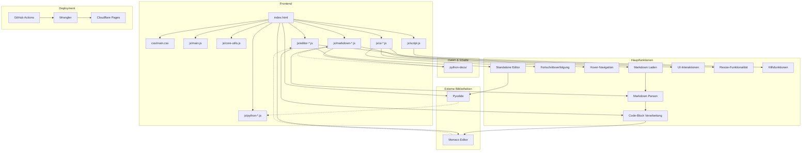

# Python-Lernplattform: Interaktives Lernen und Dokumentation

Willkommen bei der interaktiven Python-Lernplattform! Diese Plattform wurde entwickelt, um Anfängern, insbesondere im Alter von 12-14 Jahren, den Einstieg in die Programmierung mit Python so einfach und unterhaltsam wie möglich zu gestalten.

## Projektbeschreibung

Diese Plattform ist eine interaktive Lernumgebung, die es Benutzern ermöglicht, Python direkt im Browser zu lernen und auszuprobieren, ohne dass eine lokale Softwareinstallation erforderlich ist. Unser Ziel ist es, eine zugängliche, benutzerfreundliche und motivierende Lernerfahrung zu schaffen.

## Verbesserte Dokumentationsstruktur (Kapitel 0-3)

Die Lerninhalte sind in übersichtliche Kapitel unterteilt, die schrittweise in die Welt von Python einführen:

| Kapitel     | Thema                         | Hauptinhalte                                                                 |
|-------------|-------------------------------|------------------------------------------------------------------------------|
| **Kapitel 0** | **Einführung und erste Schritte** | Was ist Programmieren? Warum Python? Erste Schritte auf verschiedenen Geräten (Windows, Mac, Mobile mit Replit), Installation von VSCode (optional). |
| **Kapitel 1** | **Grundlagen der Programmierung** | Textausgabe in der Konsole, Variablen und grundlegende Datentypen (Zahlen, Text), einfache Operatoren, Arbeit mit Strings. |
| **Kapitel 2** | **Kontrollstrukturen**          | Logische Entscheidungen mit bedingten Anweisungen (`if`, `else`), Wiederholungen mit Schleifen (`for`, `while`). |
| **Kapitel 3** | **Einfache Datenstrukturen**   | Einführung in Listen zum Speichern und Verwalten von mehreren Werten.         |

Jedes Kapitel wird durch eine `index.md`-Datei eingeleitet, die eine Übersicht über die Lernziele und Inhalte des jeweiligen Kapitels bietet und so die Navigation erleichtert.

## Zusammenfassung der Verbesserungen

Um das Lernen besonders für junge Anfänger ansprechender und effektiver zu gestalten, wurden folgende Verbesserungen vorgenommen:

*   **Zielgruppengerechte Erklärungen:** Inhalte wurden überarbeitet und erweitert, um sie für 12-14-jährige Anfänger verständlicher und zugänglicher zu machen. Komplexe Konzepte werden einfach und mit Beispielen aus der Lebenswelt der Jugendlichen erklärt.
*   **Praktische Beispiele und Übungen:** Jedes Konzept wird durch praktische Code-Beispiele veranschaulicht, die direkt im Browser ausprobiert werden können. Zusätzliche Übungsaufgaben am Ende der Lektionen helfen, das Gelernte zu festigen.
*   **Verbesserte Struktur und visuelle Elemente:** Eine klare Struktur mit deutlichen Überschriften, Hervorhebungen und ggf. unterstützenden visuellen Elementen (wie Diagramme oder Illustrationen, falls vorhanden) erleichtert das Verständnis und die Lesbarkeit.
*   **Neue Kapitelübersichtsseiten (`index.md`):** Jedes Kapitel (0-3) verfügt nun über eine eigene Übersichtsseite, die den Einstieg in das jeweilige Thema erleichtert und die Navigation innerhalb der Dokumentation verbessert.

## Hinweis zur Navigation

Wir empfehlen, die Kapitel in der vorgesehenen Reihenfolge (0, 1, 2, 3) durchzuarbeiten, da die Inhalte aufeinander aufbauen. Nutze die Navigationsleiste auf der linken Seite, um zwischen den Kapiteln und Lektionen zu wechseln. Die `index.md`-Seiten in jedem Kapitel geben dir einen guten Überblick.

## Mögliche zukünftige Verbesserungen

Wir planen, die Plattform kontinuierlich weiterzuentwickeln. Mögliche zukünftige Verbesserungen könnten umfassen:

*   **Erweiterung der Kapitel:** Hinzufügen weiterer Kapitel zu fortgeschritteneren Python-Themen (z.B. Funktionen, komplexere Datenstrukturen, einfache Spieleprogrammierung).
*   **Interaktive Quizze und Herausforderungen:** Integration von mehr interaktiven Elementen zur Wissensüberprüfung.
*   **Gamification-Elemente:** Einführung von Punkten, Badges oder anderen spielerischen Anreizen.
*   **Community-Funktionen:** Möglichkeiten zum Austausch mit anderen Lernenden.
*   **Video-Tutorials:** Ergänzung der textbasierten Inhalte durch kurze Videoerklärungen.

## Ursprüngliche Projektübersicht und technische Details

(Dieser Abschnitt behält wichtige Informationen aus der vorherigen README bei.)

Diese interaktive Lernplattform wurde entwickelt, um Anfängern und Fortgeschrittenen das Erlernen der Programmiersprache Python zu erleichtern. Das Hauptziel ist es, eine zugängliche und benutzerfreundliche Umgebung zu schaffen, in der Benutzer Python-Konzepte direkt im Browser verstehen und anwenden können, ohne lokale Softwareinstallationen vornehmen zu müssen.

**Hauptfunktionen (ursprünglich):**

*   **Interaktive Code-Editoren:** Eingebettete Monaco-Editoren ermöglichen das Schreiben und Ausführen von Python-Code direkt in den Lektionen.
*   **Browserbasierte Ausführung:** Python-Code wird mithilfe von Pyodide im Browser ausgeführt, was eine sofortige Rückmeldung ermöglicht.
*   **Strukturierte Lernpfade:** Inhalte sind in logische Kapitel gegliedert.
*   **Markdown-basierte Inhalte:** Lektionen und Erklärungen sind in Markdown verfasst.
*   **Fortschrittsverfolgung:** Der Lernfortschritt wird lokal im Browser gespeichert.
*   **Interaktive Quizze:** Kapitelweise Tests zur Überprüfung des Verständnisses.
*   **Responsive Design:** Optimiert für verschiedene Geräte.
*   **Eigenständiger Editor:** Ein separater Vollbild-Editor (`code-editor.html`) für freies Experimentieren.

## Starte Hier wenn du Python Lernen willst (ursprünglicher Link):

# [**Startseite**](./python-docs/Kapitel_0/Anfang_Lese_Mich.md)


## Code Doku (ursprünglich)


1. **Lokale Entwicklung starten:**
   ```bash
   # Lokalen Entwicklungsserver starten
   node js/server.js
   ```

2. **Neue Inhalte hinzufügen:**
   - Erstelle neue Markdown-Dateien im Verzeichnis `python-docs/`
   - Füge Links zu neuen Dateien in `python-docs/Kapitel_0/Anfang_Lese_Mich.md` hinzu

3. **Deployment:**
   - Push zum Hauptbranch löst automatisches Deployment auf Cloudflare Pages aus
   - Oder manuell mit `wrangler pages publish .`

## Architekturübersicht (ursprünglich)

Die Python-Lernplattform ist eine clientseitige Webanwendung, die Markdown-Dokumente lädt, interaktive Python-Code-Editoren bereitstellt und Python-Code direkt im Browser ausführt.



(Weitere technische Details wie CSS-Modulstruktur, Datenfluss, Komponentendetails, Herausforderungen, Architekturprinzipien, Deployment-Details, Dateistruktur, Hauptkomponenten, Layout-Struktur, Markdown-Verarbeitung, Code-Editor-Funktionalität, Responsive Design, Quiz-System, ursprüngliche Erweiterungsmöglichkeiten, Wartungstipps und lokale Entwicklungsinformationen bleiben wie in der vorherigen README.md, um Redundanz zu vermeiden, können aber bei Bedarf hier vollständig eingefügt werden. Für diese Aktualisierung liegt der Fokus auf den neuen, benutzerorientierten Informationen.)

## Installation und Einrichtung (falls zutreffend)

(Dieser Abschnitt kann beibehalten oder angepasst werden, falls spezifische Installationsschritte für die Nutzung der Lernplattform oder für Beitragende relevant sind. Für die reine Online-Nutzung ist keine Installation erforderlich.)

```bash
# Beispiel für lokale Entwicklung (falls beibehalten)
node js/server.js
```
Öffne http://localhost:3000 im Browser.